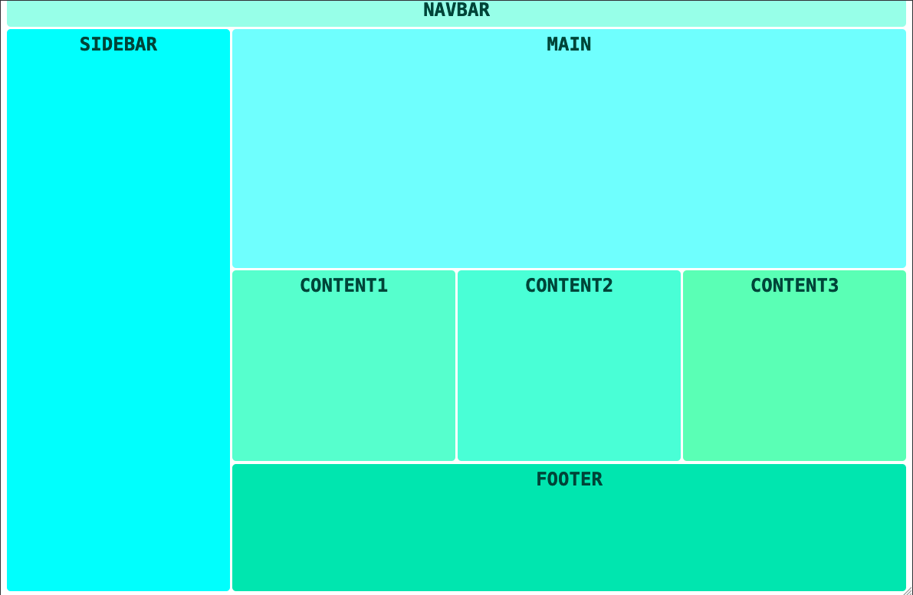
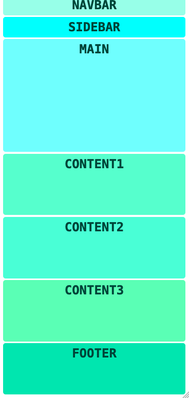

# Responsive CSS Grid
A simple, web-to-mobile design website template based on the [tutorial taught by Angela Delise](https://youtu.be/68O6eOGAGqA). I completed this tutorial on as part of the #100DaysOfCode challenge, see my reflection for [Day 78](https://github.com/ananfito/100-days-of-code/blob/main/day78.md) for more details.

## Web Version

## Mobile Version

